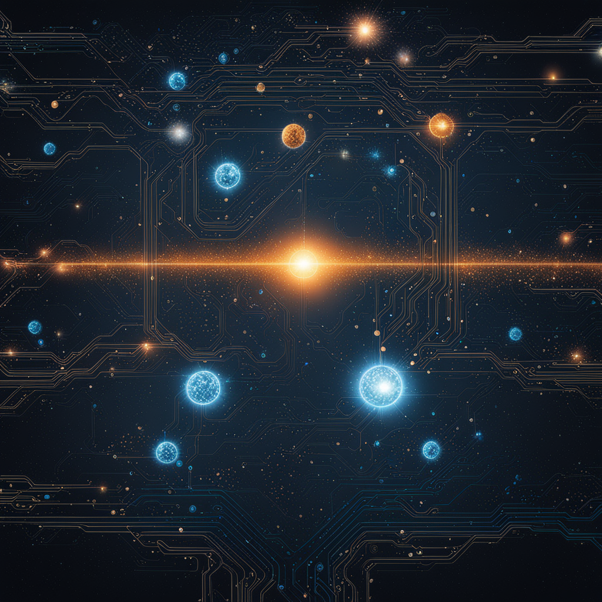
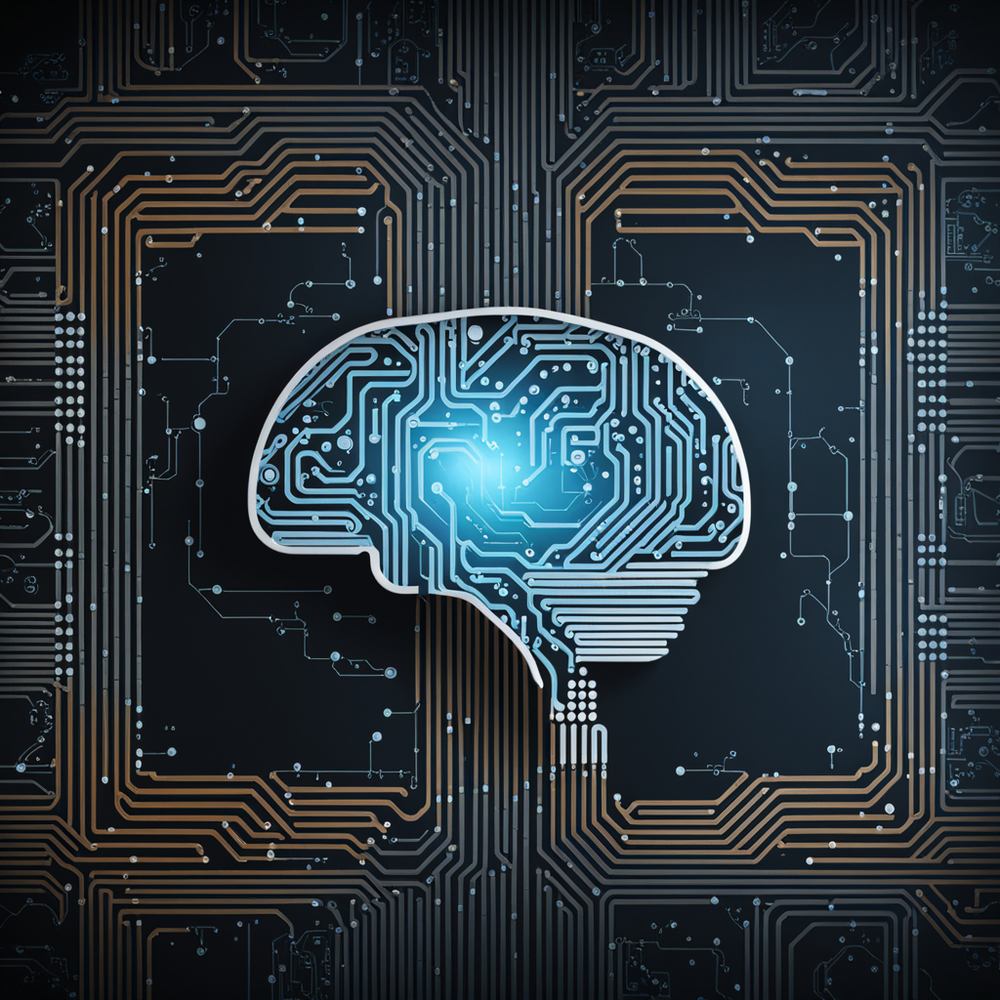

En la era de la inteligencia artificial (IA), la creación automática de contenido visual mediante imágenes y videos generados a través de prompts (Entrada de Textos) ha revolucionado la forma en que concebimos la creatividad. Sin embargo, este avance tecnológico no está exento de los desafíos legales, especialmente en lo que tiene que ver con los derechos de autor y sus implicaciones.

A propósito,

***
“En el contexto de inteligencia artificial (IA), un "prompt" se refiere a la entrada de datos o instrucciones que se proporcionan a un modelo de lenguaje para que genere una respuesta. Un prompt puede ser una frase, una pregunta o cualquier tipo de entrada de texto que se utilice para solicitar información o realizar una tarea específica.
Los prompts son esenciales en la interacción con modelos de lenguaje y otros sistemas de IA basados en texto, ya que proporcionan la entrada necesaria para que el modelo genere salidas significativas. La forma en que se formula el prompt puede afectar significativamente los resultados obtenidos.”
***

Tradicionalmente, los derechos de autor se han asignado a los creadores humanos, esto quiere decir en pocas palabras, que para que se reconozcan los derechos de autor de una obra se deben cumplir dos requisitos fundamentales: Que sea una obra original, es decir que la obra refleja la personalidad del autor y que no sea una copia o imitación de otra obra y segundo, que sea el fruto de la creatividad humana, esto significa que sea el fruto del esfuerzo intelectual del autor y no de un proceso mecánico o aleatorio.

##  El Poder de la Inteligencia Artificial Generativa

Hoy en día, herramientas de IA avanzadas pueden crear ideas, contenidos nuevos, historias, generar imágenes y videos asombrosos a partir de simples instrucciones o prompts. Esto ha democratizado la creatividad, permitiendo a personas de diversos campos explorar nuevas ideas y conceptos de manera más rápida y eficiente.

## Pero, la pregunta del millón, quién es el Creador?

Uno de los dilemas principales surge al cuestionar la autoría de estos contenidos generados automáticamente por una IA. Los contenidos creados con IA son originales? Los contenidos creados con IA son fruto de la creatividad humana?, máxime cuando sabemos que son generados por máquinas que no tiene personalidad ni intención, y que se basan en modelos, datos previos, algoritmos definidos y entrenados.

Tradicionalmente, los derechos de autor se han asignado a los creadores humanos, pero la IA introduce una complejidad adicional. ¿Es el usuario que proporciona el prompt el creador, o la IA que interpreta y genera el contenido, la imagen o el video?, ¿buena pregunta verdad?

## Los Desafíos Legales en la Era de la IA Generativa

A medida que la creación automática de contenido se vuelve más común, los desafíos legales se intensifican. La cuestión de la originalidad y la propiedad intelectual se vuelve borrosa, ya que los límites entre la creatividad humana y la generada por IA se difuminan.

## Protegiendo los Derechos de Autor en un Mundo Impulsado por la IA

Para abordar estos desafíos, es esencial que las leyes de derechos de autor evolucionen para adaptarse a la era de la IA. Esto podría implicar una reconsideración de cómo se otorgan los derechos y quién tiene la responsabilidad final sobre el contenido generado.

Aquí les dejo 5 opciones sobre la mesa:

1. Negar los derechos de autor a los contenidos creados con IA considerándolos como obras huérfanas, o de dominio público, significa que cualquiera puede utilizar estos contenidos sin ninguna autorización.

2. Reconocer la protección por derechos de autor a los contenidos creados con inteligencia artificial atribuyéndolos al autor o propietarios del modelo de sistema de IA que lo genera, implica que solo el dueño del sistema puede usar y explotar comercialmente estos contenidos o autorizar su uso por un tercero.

3. Reconocer la protección de derechos de autor a los contenidos creados con inteligencia artificial atribuyéndolos al autor o propietario del texto de la imagen original que sirve como entrada al modelo de IA (prompt), esto implica que solo el autor o propietario de ese texto, tenga los derechos. (Algo casi imposible de saber o verificar.)

4. Reconocer la protección por derechos de autor a los contenidos creados con inteligencia artificial atribuyéndolos al usuario o cliente del modelo de IA que lo genera, esto implica que solo el usuario que escribió el prompt y uso la IA puede usar y explotar estos contenidos o autorizar su uso a terceros.

5. Reconocer la protección por derechos especiales a los contenidos creados con inteligencia artificial, es decir crear una categoría especial para ellos, esto implica que se establezcan unas normas particulares para regular el uso y la explotación de estos contenidos teniendo en cuenta que son creados por IA.

## Transparencia y Ética en la Creación Automática

Además de los aspectos legales, la ética juega un papel crucial en el desarrollo y uso de tecnologías de IA generativa. La transparencia en la atribución y la divulgación de la participación de la IA en la creación de contenido son aspectos esenciales para construir un entorno creativo ético y sostenible.

## Navegando por un Nuevo Horizonte Creativo

Si bien los derechos de autor en la era de la IA presentan grandes desafíos, también abren oportunidades para repensar cómo valoramos y protegemos la creatividad en un mundo impulsado por la tecnología. A medida que avanzamos, es imperativo que la legislación y la ética evolucionen para garantizar un equilibrio justo entre la innovación y la protección de los derechos de autor.

## La IA llegó para quedarse…

Es innegable que la IA está aquí para quedarse, no como un sustituto de nuestra creatividad, sino como potencializador de ella. En lugar de temer a la automatización creativa, abracemos la colaboración sin fisuras entre nuestras mentes y las capacidades infinitas de la inteligencia artificial. Este matrimonio entre lo humano y lo digital no solo redefine los límites de la creatividad, sino que también desata un potencial inexplorado.

La inteligencia artificial no es solo una herramienta; es un catalizador de innovación, una chispa que enciende el fuego de la creatividad en formas que nunca antes habíamos imaginado. Nos desafía a repensar, a reinventar, a ser más audaces en nuestras aspiraciones creativas.

En este viaje hacia el futuro, nuestra capacidad para abrazar la inteligencia artificial con una ética sólida y una visión clara determinará no solo el rumbo de la innovación, sino también la esencia misma de nuestra humanidad.

Así que, sigamos explorando, descubriendo y creando, con la certeza de que la inteligencia artificial no solo está aquí para quedarse, sino también colocar en otro nivel nuestras capacidades creativas. La revolución de la inteligencia artificial es nuestro nuevo capítulo creativo, y estamos apenas en la primera página de esta historia fascinante y eterna.

## ¿Cuál es tu perspectiva sobre los derechos de autor en la creación automática de contenido?
